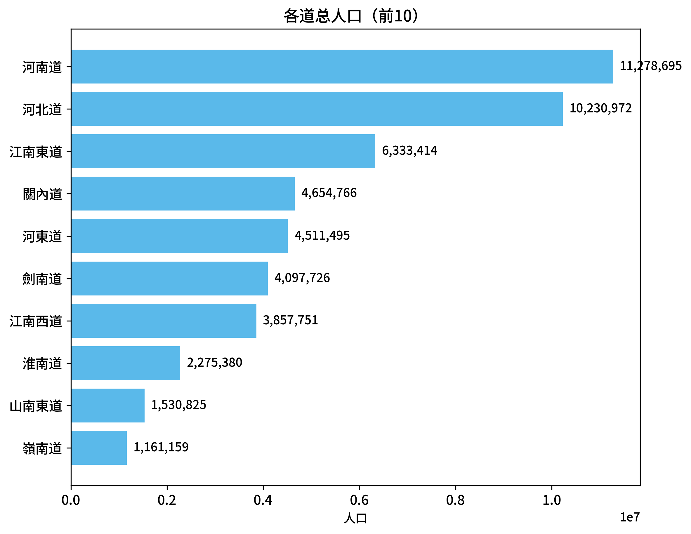
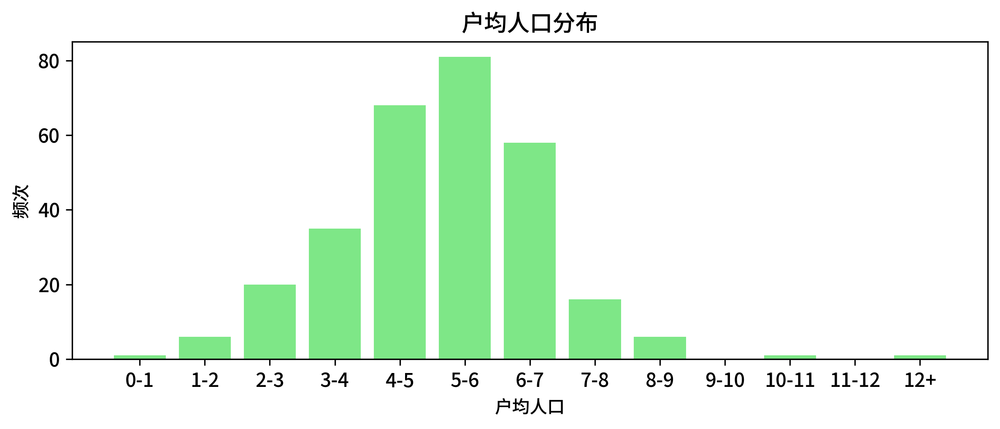
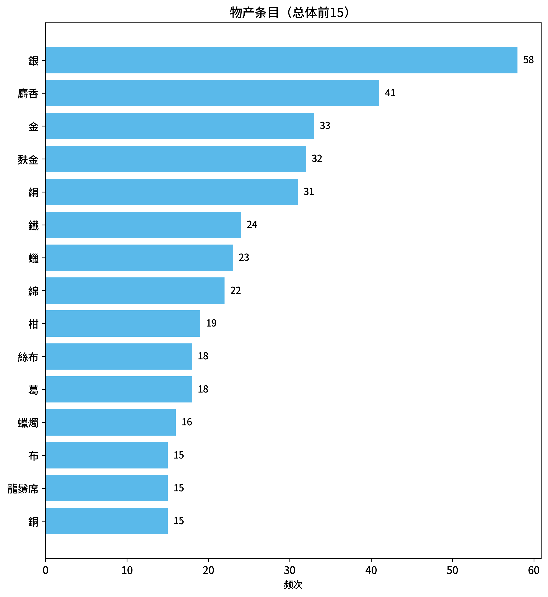
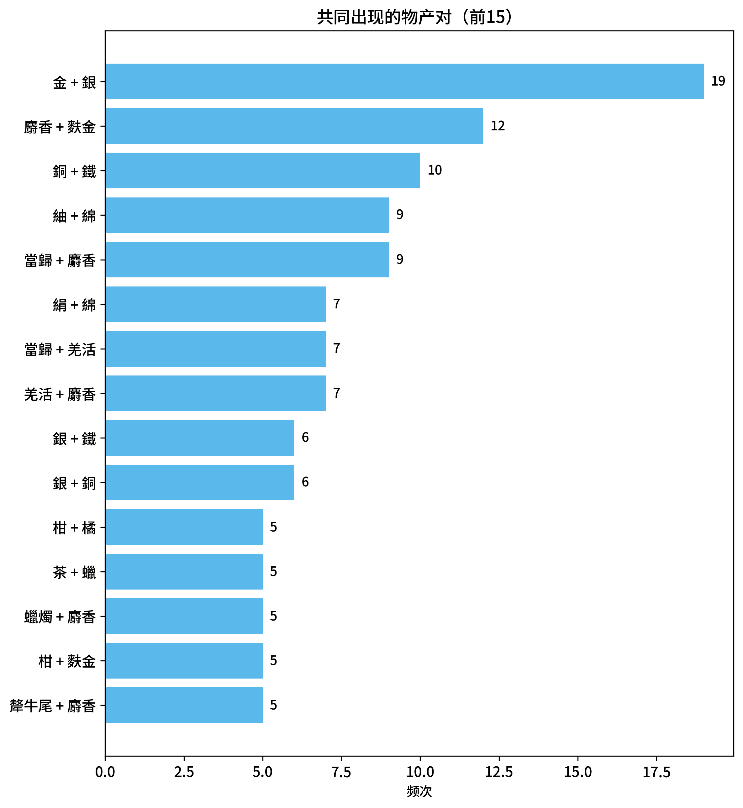

# 唐代各地人口物产

可视化与可视分析课程设计

## 任务背景

开元年间，唐朝在各方面都达到了极高的水平，国力空前强盛，社会经济空前繁荣，人口大幅度增长，天宝年间唐朝人口达到8000万人。本项目旨在通过对唐代各地的人口和物产数据进行可视化，展开对这一鼎盛时期时期唐代社会经济与人口分布的探索。

## 数据介绍

本项目的原始数据来自《新唐书·地理志》，即《新唐书》卷三十七至卷四十三下。它是由北宋史学家欧阳修、宋祁等人奉敕修撰的官修史书中的地理专志，在中国古代地理学和历史学中占有举足轻重的地位。

### 原始数据

本项目中使用的《新唐书》（卷三十七至卷四十三下）原文下载自 [维基文库 Wikisource](https://zh.wikisource.org/wiki/新唐書) ，分成了8个txt文件（`地理一.txt`, ... `地理七下.txt`），共381KB。文档节选如下：

*地理一* :
> 自秦變古，王制亡，始郡縣天下。下更漢、晉，分裂為南、北。至隋滅陳，天下始合為一，乃改州為郡，依漢制置太守，以司隸、刺史相統治，為郡一百九十，縣一千二百五十五，戶八百九十萬七千五百三十六，口四千六百一萬九千九百五十六。其地：東西九千三百里，南北一萬四千八百一十五里，東、南皆至海，西至且末，北至五原。
> 
> 唐興，高祖改郡為州，太守為刺史，又置都督府以治之，然天下初定，權置州郡頗多。太宗元年，始命併省，又因山川形便，分天下為十道：一曰關內，二曰河南，三曰河東，四曰河北，五曰山南，六曰隴右，七曰淮南，八曰江南，九曰劍南，十曰嶺南。至十三年定簿，凡州府三百五十八，縣一千五百五十一。明年，平高昌，又增州二，縣六。其後，北殄突厥頡利，西平高昌，北踰陰山，西抵大漠。其地：東極海，西至焉耆，南盡林州南境，北接薛延陀界；東西九千五百一十一里，南北一萬六千九百一十八里。景雲二年，分天下郡縣，置二十四都督府以統之。既而以其權重不便，罷之。開元二十一年，又因十道分山南、江南為東、西道，增置黔中道及京畿、都畿，置十五採訪使，檢察如漢刺史之職。天寶盜起，中國用兵，而河西、隴右不守，陷于吐蕃，至大中、咸通，始復隴右。乾符以後，天下大亂，至於唐亡。
> 
> 然舉唐之盛時，開元、天寶之際，東至安東，西至安西，南至日南，北至單于府，蓋南北如漢之盛，東不及而西過之。開元二十八年戶部帳，凡郡府三百二十有八，縣千五百七十三，戶八百四十一萬二千八百七十一，口四千八百一十四萬三千六百九，應受田一千四百四十萬三千八百六十二頃。
> 
> 考隋、唐地理之廣狹、戶口盈耗與其州縣廢置，其盛衰治亂興亡可以見矣。蓋自古為天下者，務廣德而不務廣地，德不足矣，地雖廣莫能守也。嗚呼，盛極必衰，雖曰勢使之然，而殆忽驕滿，常因盛大，可不戒哉！
> 
> 關內道
> 
> 關內道，蓋古雍州之域，漢三輔、北地、安定、上郡及弘農、隴西、五原、西河、雲中之境。京兆、華、同、鳳翔、邠、隴、涇、原、渭、武、寧、慶、鄜、坊、丹、延、靈、威、雄、會、鹽、綏、宥為鶉首分，麟、豐、勝、銀、夏、單于、安北為實沈分，商為鶉火分。為府二，都護府二，州二十七，縣百三十五。其名山：太白、九嵕、吳、岐、梁、華。其大川：涇、渭、灞、滻。厥賦：絹、綿、布、麻。〈京兆、同、華、岐調綿，餘州布、麻。開元二十五年，以關輔寡蠶，詔納米粟，其河南、河北非通漕州，皆調絹，以便關中。〉厥貢：毛、羽、革、角、布、席、弓、刀。
> 
> 上都
> 
> 上都，初曰京城，天寶元年曰西京，至德二載曰中京，上元二年復曰西京，肅宗元年曰上都。〈皇城長千九百一十五步，廣千二百步。宮城在北，長千四百四十步，廣九百六十步，周四千八百六十步，其崇三丈有半。龍朔後，皇帝常居大明宮，乃謂之西內，神龍元年曰太極宮。大明宮在禁苑東南，西接宮城之東北隅，長千八百步，廣千八十步，曰東內，本永安宮，貞觀八年置，九年曰大明宮，以備太上皇清暑，百官獻貲以助役。高宗以風痺，厭西內湫濕，龍朔二年始大興葺，曰蓬萊宮，咸亨元年曰含元宮，長安元年復曰大明宮。興慶宮在皇城東南，距京城之東，開元初置，至十四年又增廣之，謂之南內，二十年，築夾城入芙蓉園。京城前直子午谷，後枕龍首山，左臨灞岸，右抵灃水，其長六千六百六十五步，廣五千五百七十五步，周二萬四千一百二十步，其崇丈有八尺。〉
> 
> 京兆府
> 
> 京兆府，京兆郡，本雍州，開元元年為府。厥貢：水土稻、麥、麰、紫稈粟、隔紗、粲席、鞾氈、蠟、酸棗仁、地骨皮、櫻桃、藕粉。天寶元年領戶三十六萬二千九百二十一，口百九十六萬一百八十八。領縣二十。〈有府百三十一，曰真化、匡道、水衡、仲山、新城、竇泉、善信、鳳神、安業、平香、太清，餘皆逸。〉
> 
> ...

### 数据整理

我们首先将州/府级以上地名提取出来，录入文档，格式如下：

```markdown
### 摘自《新唐書·志第二十七·地理一》

**關內道**
*   上都
*   京兆府 (京兆郡)
*   華州 (華陰郡, 上輔)
*   同州 (馮翊郡, 上輔)
*   商州 (上洛郡, 望)
*   鳳翔府 (扶風郡, 赤上輔)
*   邠州 (新平郡, 緊)
*   隴州 (汧陽郡, 上)
*   涇州 (保定郡, 上)
*   原州 (平涼郡, 中都督府, 望)
...
```

一共363个条目。

接下来，针对以下两个子任务，分别建立LLM workflow：为每个Agent分配一个地名，自动化提取信息：

1. **查询地理坐标及对应现代行政区划**
   
   地理坐标（经纬度）信息来自 [中国历史地理信息系统 CHGIS](https://yugong.fudan.edu.cn/CHGIS/sjxz.htm) ，我们编写了接入该API、便于LLM调用的 [MCP工具](https://github.com/huajibing/CHGIS_MCP_Server)；行政区划查询使用了 [高德地图逆地理编码API](https://lbs.amap.com/api/webservice/guide/api/georegeo)。

   LLM查询信息后，按照层级顺序将所有结果录入 `locations.json` ，片段如下：

   ```json
   {
    "locations": [
        {
        "Location_ID": "dao_001",
        "Location_Name": "關內道",
        "Parent_ID": null,
        "Administrative_Level": "道",
        "Latitude": null,
        "Longitude": null,
        "Present_Location": null
        },
        {
        "Location_ID": "capital_001",
        "Location_Name": "上都",
        "Parent_ID": "dao_001",
        "Administrative_Level": "都",
        "Latitude": null,
        "Longitude": null,
        "Present_Location": null
        },
        {
        "Location_ID": "fu_00001",
        "Location_Name": "京兆府",
        "Parent_ID": "dao_001",
        "Administrative_Level": "府",
        "Latitude": 34.24642,
        "Longitude": 108.90698,
        "Present_Location": "陕西省西安市莲湖区"
        },
        ...
      ]
    }
   ```

2. **从原文中提取户、口数及物产种类**
   
   同样的方法，我们为每个AI agent分配了一个地名，agent通过调用 `grep` 工具在原文中查询，定位上下文，接着提取户数、口数、物产（分类），最终录入 `population_products.json` ，片段如下：
   
   ```json
    {
        "population_products": [
            ...
            {
                "Location_ID": "fu_00006",
                "Location_Name": "河南府",
                "Administrative_Level": "府",
                "Households": 194746,
                "Population": 1183092,
                "Confidence": 0.95,
                "Notes": "见于地理二卷：土贡：文綾、繒、縠、絲葛、埏埴盎缶、苟𣏌、黃精、美果華、酸棗；户194746，口1183092",
                "Products": {
                    "农产品": [
                        "美果華",
                        "酸棗"
                    ],
                    "纺织品": [
                        "文綾",
                        "繒",
                        "縠",
                        "絲葛"
                    ],
                    "药材": [
                        "苟𣏌",
                        "黃精"
                    ],
                    "矿产/金属": [],
                    "畜产品/土特产": [],
                    "其他/待分类": [
                        "埏埴盎缶"
                    ]
                },
                "Raw_Excerpts": [
                    {
                    "file": "original_text/地理二.txt",
                    "start": 23,
                    "end": 31,
                    "text": "河南府\n\n河南府河南郡，本洛州，開元元年為府。土貢：文綾、繒、縠、絲葛、埏埴盎缶、苟𣏌、黃精、美果華、酸棗。戶十九萬四千七百四十六，口百一十八萬三千九十二。..."
                    }
                ]
            },
            ...
        ]
    }
   ```

收集到 `population_products.json` 后，利用Python将核心信息提取为 `population_products_export.csv` :

```csv
Location_Name,Parent_Name,Households,Population,药材,纺织品,矿产/金属,畜产品/土特产,农产品,其他/待分类
關內道,,,,,布; 席,,毛; 羽; 革; 角,,弓; 刀
上都,關內道,,,,,,,,
京兆府,關內道,362921,1960188,酸棗仁; 地骨皮,隔紗; 粲席; 鞾氈,,蠟; 櫻桃; 藕粉,水土稻; 麥; 麰; 紫稈粟,
華州,關內道,33187,223613,伏苓; 伏神; 細辛,,,鷂; 烏鶻,,
...
```

### 数据分析

我们对收集到的人口物产数据进行了初步的统计和分析，初步分析结果如下

有效数据共363条，不包含《地理七下》中的内容，因为各都督府未载户、口、物产信息。

#### 人口

在363个道/州/府单位中，记载了户数的单位有322个，记录了人口数的单位有293个。

各个道的总人口统计（前十）如下图：


户均人口分布：


#### 物产

各中物产按出现的频次排序（前15）：


共同出现的物产对按出现的频次排序（前15）：


### 任务抽象

根据以上初步数据分析结果，提出以下探索性问题：

1.  **人口密度问题：** 河南道的人口总数遥遥领先，这是否意味着其人口密度也最大？将人口数据与各州府的地理位置结合，能否绘制出唐代的人口密度分布图，从而识别出哪些是核心经济区？

2.  **户均规模差异：** 户均人口直方图显示，大部分地区的户均人口集中在4-6人，但存在一些离群值。这些户均人口异常高或低的地区在哪里？它们的地理分布或物产结构有什么共同特征吗？

3.  **物产的地理聚集性：** 各种物产的分布是否呈现出明显的地理聚集特征？例如，纺织品是否主要集中在人口稠密的平原地区？矿产或土特产是否与特定的山脉或水系相关？

4.  **物产的共现关系：** 初步分析展示了共同出现的物产对。这些经常结伴出现的物产组合在地理上是如何分布的？这种共现关系能否揭示当时的地区产业结构或贸易网络？

5.  **物产类型与人口规模的关系：** 人口稠密的地区（如京兆府、河南府）其物产主要是消耗性的农产品和满足大量人口需求的手工业品（如纺织品），还是高价值的贡品？反之，人口稀疏的地区是否主要出产依赖自然资源的土特产或矿产？

6.  **物产丰富度与人口的关系：** 一个地区出产的物产种类数量，与其户数或人口数是否存在正相关关系？是否可以认为物产越丰富的地区，能供养的人口也越多？

综合以上问题，本项目的核心任务是 **利用多视图联动的可视化方法，交互式地探索唐代（开元、天宝年间）人口、物产在地理空间上的分布规律，并揭示二者之间的相互关系，从而展现唐代社会经济的基本格局。**

具体任务目标如下：

1. 在地图上直观展示唐代各州府的人口规模与物产分布。

2. 支持用户从不同维度（如行政区划、人口规模、物产类别）对数据进行钻取和关联分析。

3. 通过可视化手段，帮助用户发现并验证人口数量、密度与物产类型、丰富度之间的关联。